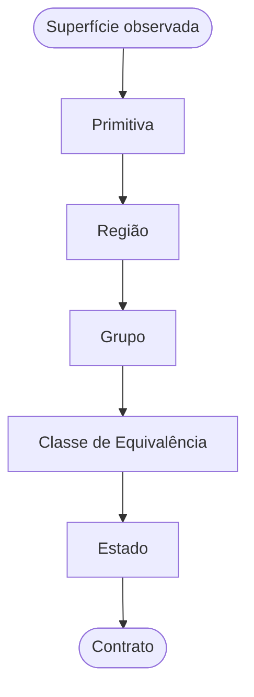
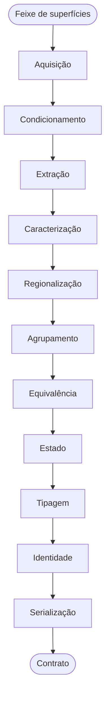
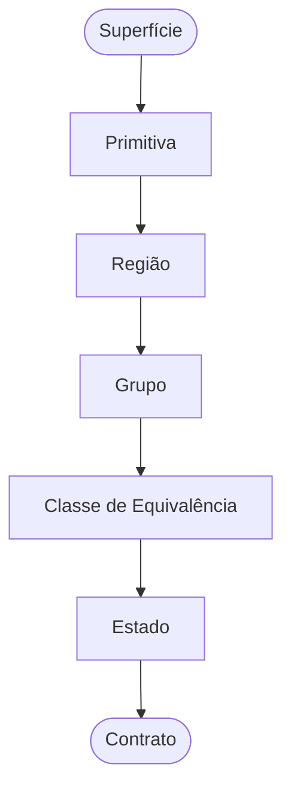
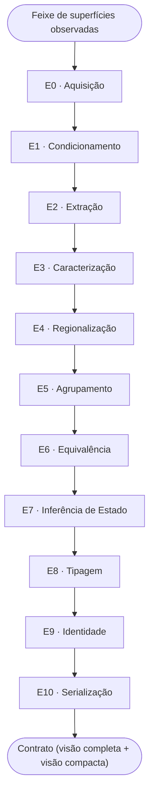

# PERCEPTION_PIPELINE_SPEC — Arquitetura do Motor de Percepção de Interface

**Status:** rascunho para discussão (v0.2) · **Data:** 2026-08-05
**Escopo:** arquitetura e fluxo de dados. Este documento **não** nomeia algoritmos, bibliotecas, espaços de cor, motores de OCR ou técnicas de visão computacional. Se um nome de técnica aparecer aqui, é erro de redação.

**Relação com os outros documentos:**

| Documento | Autoridade sobre | Não decide |
|---|---|---|
| `PERCEPTION_PIPELINE_SPEC.md` (este) | Objetos, estágios, fluxo, invariantes | O que medir; como medir |
| `VISUAL_FEATURE_SPEC.md` | Quais propriedades devem ser medidas | Como medir; arquitetura |
| Decisões de implementação | Como medir | Nada acima |

Um documento nunca pode contradizer o de cima. Técnica é substituível sem revisar esta especificação — esse é o propósito da separação.

---

## Sumário Executivo

**O problema.** OCR lê caracteres; não lê interface. Ele não responde qual página está aberta, qual item está selecionado, nem o que uma região da tela representa estruturalmente. Hoje, na ausência de resposta, essas perguntas tendem a virar regras específicas por fabricante de BIOS — frágeis, e sem nenhuma evidência de que generalizem além dos casos vistos.

**A solução.** Um motor de percepção que converte a imagem numa cadeia fixa de objetos estruturais, e só isso. Ele nunca decide significado, apenas estrutura e estado visual. A cognição (LLM) entra depois, consumindo o resultado — a percepção nunca decide por ela.

**Objetos fundamentais.**



Cada objeto existe só para estabelecer o contexto de comparação do próximo: onde medir, o que pertence junto, o que é legitimamente comparável. Estado nunca é propriedade de um elemento isolado — é uma relação entre um elemento e a classe que o referencia. Sem classe, não há estado (§1).

**Regras que governam o fluxo (§2).**

- **Irreversibilidade** — um erro no objeto N não é detectável no objeto N+1, que só recebe o produto de N, não a evidência.
- **Teto** — a qualidade do motor é limitada pelo objeto mais baixo que estiver errado. Refinar Estado não compensa um Grupo malformado.
- **Abstenção antes de chute** — quando o contexto não pode ser estabelecido com confiança, o estágio declara isso em vez de entregar um resultado degradado.

**Fluxo (§3).**



Onze estágios, um-para-um com os objetos que produzem (E4→Região, E5→Grupo, E6→Classe, E7→Estado). Nenhum estágio cita técnica, biblioteca ou fabricante — isso é o que torna qualquer escolha de implementação substituível sem revisar esta especificação (§8).

**Maturidade.** A cadeia de objetos não muda entre versões do motor — só a profundidade de cada estágio (§6). A v1 mínima existe para validar o conceito, não para ser completa.

---

## 1. O objeto central

Todo o motor existe para produzir e encadear seis objetos. Tudo o mais é detalhe de implementação.



O que cada objeto estabelece para o seguinte está formalizado na tabela de §1.2.

### 1.1 Definições normativas

**PRIMITIVA.** Unidade atômica da percepção: algo presente na superfície que pode ser localizado e medido antes de qualquer interpretação. Possui geometria e aparência. **Não** possui significado, pertencimento, papel ou estado. Uma primitiva isolada nunca pode estar "selecionada" — a afirmação é malformada nesse nível.

**REGIÃO.** Área delimitada da interface cujos elementos compartilham um mesmo contexto visual. A região **não** é um componente: é o escopo dentro do qual comparar é legítimo. Regiões podem conter regiões.

**GRUPO.** Conjunto de primitivas de uma região que formam uma unidade perceptual: repetem-se, compartilham aparência e se organizam com ritmo ao longo de um eixo. O eixo, a cardinalidade e a regularidade do grupo são **produtos** da percepção, nunca premissas.

**CLASSE DE EQUIVALÊNCIA.** Subconjunto de um grupo cujos membros exercem o mesmo papel estrutural e são, portanto, mutuamente comparáveis. **É o objeto central de todo o motor.** Um grupo pode conter várias classes: numa tabela, rótulos e valores são classes distintas e comparar um contra o outro é um erro de categoria.

**ESTADO.** Não é propriedade de um elemento. É uma **relação** entre um elemento e sua classe de equivalência:

```
estado = (elemento, classe, canal, magnitude, confiança)
```

Sem classe não existe estado. Isso não é uma restrição imposta ao modelo — é uma consequência da definição, e dela decorrem dois comportamentos que de outra forma seriam casos especiais:

- classe de tamanho 1 ⇒ nenhum estado é derivável (não há com o que comparar);
- classe heterogênea demais ⇒ nenhum estado é derivável (a referência não é confiável).

Em ambos os casos a saída correta é abstenção, e ela cai fora do modelo naturalmente, sem regra ad hoc.

**CONTRATO.** Projeção serializada e versionada dos objetos acima. É a **única** coisa que a camada de cognição enxerga.

### 1.2 O invariante que sustenta a arquitetura

> **Cada objeto existe para estabelecer o contexto de comparação do objeto seguinte.**

| Objeto | Estabelece |
|---|---|
| Primitiva | O que pode ser medido |
| Região | Onde comparar é legítimo |
| Grupo | O que pertence junto |
| Classe | O que é comparável |
| Estado | Como um difere dos comparáveis |
| Contrato | O que é comunicado |

Duas consequências diretas, e ambas são regras de projeto:

**Regra da irreversibilidade.** Um erro cometido no objeto N não é detectável nem corrigível no objeto N+1, porque N+1 recebe apenas o *produto* de N, não a evidência que o gerou. Um grupo errado produz uma classe errada, que produz um estado errado — e nada a jusante consegue perceber isso.

**Regra do teto.** A qualidade do motor é limitada superiormente pela qualidade do objeto mais baixo que estiver errado. Investir em detecção de estado enquanto o agrupamento estiver frágil não melhora o resultado.

É por isso que o caso conhecido de menu vertical não detectado é falha de **Região/Grupo**, e não falha de Estado. Nenhum ajuste na inferência de estado pode corrigi-lo.

---

## 2. Princípios de fluxo

**F1 — Unidirecionalidade.** O fluxo é acíclico. Um estágio consome apenas o produto do estágio imediatamente anterior. Nenhum estágio consulta um estágio acima de si.

**F2 — Sem salto de nível.** Nenhum estágio pode pular objetos. É proibido derivar estado diretamente de primitivas: sem região, grupo e classe, a afirmação é malformada (§1.1).

**F3 — Abstenção propaga, degradação não.** Um estágio que não consegue estabelecer seu contexto com confiança suficiente **declara isso** e não entrega um contexto degradado. Entregar contexto degradado é pior que não entregar, porque os estágios seguintes não têm como perceber a degradação (Regra da irreversibilidade).

**F4 — Proveniência obrigatória.** Todo produto carrega de onde veio: qual estágio o gerou, sobre quais insumos, com que confiança.

**F5 — Preservação do inferior.** O produto de cada estágio permanece disponível na saída final junto com os produtos superiores. Se a interpretação estiver errada, a cognição ainda tem material bruto para se recuperar.

**F6 — Substituibilidade.** Qualquer estágio pode ser substituído por outra implementação sem alterar os demais, desde que respeite seu contrato de entrada e saída. Isso é o que torna a escolha de técnica reversível.

**F7 — Determinismo.** Mesma entrada ⇒ mesma saída. O conjunto de parâmetros efetivos acompanha a saída.

---

## 3. Estágios

Os estágios existem para produzir os objetos de §1. O mapeamento é deliberadamente um-para-um onde possível: **o estágio N produz o objeto N.**



Entrada e saída exatas de cada estágio estão na tabela de contratos (§8).

### E0 — Aquisição

| | |
|---|---|
| **Recebe** | Superfícies observadas ao longo do tempo |
| **Produz** | Feixe validado, com metadados de observação |
| **Responsabilidade** | Decidir o que constitui uma observação estável e agrupar as observações que a compõem |
| **Não faz** | Medir, interpretar, corrigir |
| **Pode abster-se?** | Sim — feixe instável é rejeitado antes de consumir os estágios caros |

### E1 — Condicionamento

| | |
|---|---|
| **Recebe** | Feixe validado |
| **Produz** | Superfície canônica + mapa de validade + laudo de qualidade |
| **Responsabilidade** | Tornar as medições comparáveis entre observações: geometria canônica, resposta fotométrica estável, marcação do que não é mensurável |
| **Não faz** | Detectar qualquer coisa; produzir semântica |
| **Pode abster-se?** | Sim — abaixo do mínimo de qualidade, o feixe é rejeitado |

> **Requisito crítico:** o condicionamento deve preservar variação que é *conteúdo da interface* e remover apenas variação que é *artefato da observação*. Confundir as duas destrói informação real. Este é o requisito mais difícil do estágio e não pode ser satisfeito por simplificação.

### E2 — Extração de primitivas

| | |
|---|---|
| **Recebe** | Superfície canônica + mapa de validade |
| **Produz** | Conjunto **não ordenado** de primitivas |
| **Responsabilidade** | Encontrar tudo que é localizável, a partir de **múltiplas fontes independentes** |
| **Não faz** | Agrupar, ordenar, interpretar, atribuir papel |
| **Pode abster-se?** | Por fonte — a falha de uma fonte não cega as demais |

Duas **classes de fonte**, definidas pelo que entregam e não pela tecnologia que as implementa:

- **Fontes de primitivas simbólicas** — entregam conteúdo legível e sua localização.
- **Fontes de primitivas estruturais** — entregam forma, delimitação e ornamento sem conteúdo legível.

**Independência é requisito arquitetural, não detalhe.** Metade da estrutura de uma interface não possui conteúdo legível; um motor com uma única fonte é estruturalmente cego a ela.

> **Regra de não contaminação:** qualquer agrupamento que uma fonte produza internamente é **metadado de proveniência**, jamais estrutura de interface. Agrupamento é responsabilidade exclusiva de E4–E6. Herdar o agrupamento de uma fonte é importar o artefato dela como se fosse fato.

### E3 — Caracterização

| | |
|---|---|
| **Recebe** | Primitivas + superfície canônica |
| **Produz** | Primitivas com descritores de aparência, geometria e validade |
| **Responsabilidade** | Medir. Só isso |
| **Não faz** | Comparar, classificar, decidir |
| **Pode abster-se?** | Por descritor — descritor não confiável é marcado inválido, nunca estimado por conveniência |

É aqui que `VISUAL_FEATURE_SPEC.md` se conecta. Este documento não opina sobre *quais* descritores existem.

> **Requisito:** um descritor medido sobre área inválida não entra em nenhuma decisão a jusante. Descritor ausente e descritor inválido são coisas distintas e devem permanecer distintas.

### E4 — Regionalização

| | |
|---|---|
| **Recebe** | Primitivas caracterizadas + superfície canônica |
| **Produz** | Hierarquia de **regiões** |
| **Responsabilidade** | Delimitar contextos de comparação a partir do contexto visual comum |
| **Não faz** | Identificar componentes; nomear regiões |
| **Pode abster-se?** | Sim — sem regionalização confiável, a superfície inteira é declarada região única, e isso é **registrado**, não silenciado |

> **Requisito:** a regionalização opera sobre o contexto visual da superfície, **não** sobre a disposição das primitivas. Derivar regiões da distribuição das primitivas cria dependência circular — as primitivas se agrupam segundo a região, e a região seria definida por como elas se agrupam.

> **Requisito:** um contexto visual pode variar suavemente ao longo de sua extensão e ainda assim ser um único contexto. Tratar constância como condição de região é incorreto e quebra em interfaces reais.

### E5 — Agrupamento

| | |
|---|---|
| **Recebe** | Regiões + primitivas caracterizadas |
| **Produz** | **Grupos**, cada um com eixo, cardinalidade e regularidade |
| **Responsabilidade** | Descobrir que primitivas formam unidades perceptuais |
| **Não faz** | Decidir papel; decidir estado |
| **Pode abster-se?** | Sim — primitivas não agrupadas permanecem avulsas e são reportadas como tais |

> **Requisito:** o eixo de organização é **inferido**, jamais assumido. Qualquer estágio que pressuponha uma orientação privilegiada está incorreto por construção e falhará em qualquer interface que use a outra.

> **Requisito:** o agrupamento não pode depender de conteúdo legível. Grupos existem em interfaces sem texto algum.

### E6 — Equivalência

| | |
|---|---|
| **Recebe** | Grupos |
| **Produz** | **Classes de equivalência** com a população de referência de cada uma |
| **Responsabilidade** | Particionar cada grupo no que é legitimamente comparável |
| **Não faz** | Comparar; decidir estado |
| **Pode abster-se?** | Sim — classe pequena ou heterogênea demais é declarada não utilizável como referência |

Estágio pequeno e o mais fácil de omitir — omiti-lo é o erro mais caro do motor. Sem ele, membros de papéis diferentes acabam comparados entre si e o estado resultante é ruído com aparência de sinal.

### E7 — Inferência de estado

| | |
|---|---|
| **Recebe** | Classes de equivalência |
| **Produz** | **Estados** como relação (elemento, classe, canal, magnitude, confiança) |
| **Responsabilidade** | Identificar, dentro de cada classe, quem se afasta da população, em qual canal e com que força |
| **Não faz** | Interpretar o significado do estado |
| **Pode abster-se?** | **Sim, e é o comportamento esperado com frequência** |

Requisitos:

- Toda decisão é **relativa à classe**. Nenhum limiar absoluto de aparência decide estado.
- Canais de evidência independentes são avaliados **separadamente** e depois combinados, com registro de quais concordaram. Diferentes interfaces marcam estado por canais diferentes; colapsar canais destrói justamente a informação que dá independência de fornecedor.
- O critério de decisão deve ser **livre de escala**: preferir critérios de margem relativa entre candidatos a critérios de distância absoluta, porque estes exigem recalibração a cada interface nova.
- Restrições de cardinalidade da classe são respeitadas.
- Empate, conflito entre canais ou população insuficiente ⇒ abstenção com motivo explícito.

### E8 — Tipagem

| | |
|---|---|
| **Recebe** | Regiões, grupos, classes, estados |
| **Produz** | Tipo estrutural (fato) + hipótese semântica (opinião com confiança) |
| **Responsabilidade** | Nomear estrutura sem inventar significado |
| **Não faz** | Afirmar papel funcional |
| **Pode abster-se?** | Sim — `desconhecido` é tipo válido |

> **Requisito de separação:** tipo estrutural é o que é decidível a partir da própria superfície. Papel funcional depende de comportamento e **jamais** é emitido como fato. Os dois ocupam campos distintos do contrato, e a cognição pode descartar o segundo sem perder o primeiro.

### E9 — Identidade

| | |
|---|---|
| **Recebe** | Estrutura tipada + conteúdo |
| **Produz** | Identificador estável de tela + relação com telas já observadas |
| **Responsabilidade** | Dizer se esta tela é a mesma de antes |
| **Não faz** | **Nomear** a tela |
| **Pode abster-se?** | Sim — tela nunca vista recebe identidade nova, jamais um palpite de identidade existente |

> A identidade é derivada de **conteúdo e estrutura**, não de aparência. Aparência varia com a observação; conteúdo e estrutura, não. O motor afirma "esta é a mesma tela de identidade X"; afirmar "esta é a tela de configurações de segurança" é cognição.

### E10 — Serialização

| | |
|---|---|
| **Recebe** | Todos os produtos anteriores |
| **Produz** | Contrato versionado em duas visões |
| **Responsabilidade** | Comunicar, incluindo o que não foi decidido |
| **Não faz** | Recomputar, completar lacuna, suavizar incerteza |
| **Pode abster-se?** | Não — é o único estágio obrigado a produzir saída |

Duas visões, derivadas da **mesma execução**:

| Visão | Consumidor | Critério |
|---|---|---|
| Completa | Auditoria, depuração, regressão | Nada é omitido |
| Compacta | Cognição | Apenas o necessário para decidir |

A visão compacta é **projeção** da completa, nunca recomputação — caso contrário as duas divergem e a auditoria deixa de auditar o que rodou.

> **Requisito:** abstenções são **conteúdo do contrato**, não ausência de conteúdo. A cognição precisa distinguir "não há seleção" de "não foi possível determinar a seleção". Confundir os dois é a falha mais perigosa do motor, porque as duas situações exigem ações opostas.

---

## 4. A dimensão temporal

O feixe (E0) pode conter múltiplas observações. Isso habilita evidências indisponíveis a uma observação isolada.

**Regra única e inegociável:** evidência temporal é sempre **corroborante**, nunca necessária.

| Consequência | Por quê |
|---|---|
| Todo estágio produz resultado válido com uma única observação | Depuração por imagem isolada precisa continuar funcionando |
| Evidência temporal eleva confiança; sua ausência não a zera | Do contrário o motor fica refém do alinhamento entre observações |
| Nenhum estado depende exclusivamente de canal temporal | Degradação graciosa em vez de falha catastrófica |

O motor torna-se sensível ao histórico, o que tensiona F7 (determinismo). Resolução: o feixe efetivamente utilizado é persistido junto com a saída, tornando qualquer execução reproduzível a partir do que foi gravado.

---

## 5. Retroalimentação — decisão em aberto

F1 proíbe ciclos. Existe um argumento legítimo contra essa proibição: se E7 não encontra estado em lugar nenhum, isso é evidência de que E5 agrupou errado, e reagrupar poderia recuperar o caso.

| Opção | Prós | Contras |
|---|---|---|
| **Estritamente acíclico** (recomendado para v1) | Determinístico, testável por estágio, sem risco de não convergência | Perde casos recuperáveis |
| **Reentrada limitada** | Recupera falhas de agrupamento | Métrica por estágio deixa de ser isolável; risco de oscilação; complexidade de depuração alta |

**Recomendação:** manter acíclico em v1. Se a reentrada for adotada, deve ser **explícita, limitada a um número fixo de iterações, registrada no contrato e versionada** — nunca um comportamento implícito. A justificativa é a Regra do teto: só faz sentido reentrar quando o agrupamento já for bom o bastante para que a exceção seja rara.

---

## 6. Maturidade por estágio

A arquitetura completa não precisa existir de uma vez. O que **não** pode mudar entre versões é a cadeia de objetos de §1 — só a profundidade de cada estágio.

| Estágio | v1 (validar o conceito) | v2 (robustez) | v3 (escala) |
|---|---|---|---|
| E0 Aquisição | Observação estável, uma por vez | Feixe com histórico | Múltiplas superfícies |
| E1 Condicionamento | **Apenas geometria canônica** | + resposta fotométrica + mapa de validade | + laudo de qualidade como gate |
| E2 Extração | Fonte simbólica + fontes estruturais essenciais | Catálogo estrutural completo | Fontes adicionais |
| E3 Caracterização | Descritores de maior robustez | Catálogo completo | Descritores aprendidos |
| E4 Regionalização | Contexto visual básico | Contextos com variação suave e aninhamento | — |
| E5 Agrupamento | Eixo inferido + ritmo | Vizinhança como alternativa de degradação | Aprendido |
| E6 Equivalência | Partição por papel estrutural | + validação da população | — |
| E7 Estado | Subconjunto de canais + abstenção | Todos os canais + confiança calibrada | — |
| E8 Tipagem | Tipos estruturais | + hipóteses semânticas | — |
| E9 Identidade | Identificador estável | + relação entre telas | Mapa de navegação |
| E10 Contrato | Visão compacta | + visão completa | Contrato versionado com compatibilidade |

**Sobre E1 especificamente:** a v1 mínima é apenas geometria canônica. É o suficiente para tornar posição, tamanho e alinhamento comparáveis — que é o que E4–E6 precisam. Estabilização fotométrica e mapa de validade só se pagam quando a variação de observação passar a ser a fonte dominante de erro, e isso deve ser **medido** antes de ser construído. Antecipar essa camada é custo sem retorno demonstrado.

---

## 7. Como esta arquitetura falha

Um documento de arquitetura que não descreve o próprio modo de falha é propaganda.

| Modo de falha | Sintoma | Onde nasce |
|---|---|---|
| Contexto errado | Estados plausíveis e sistematicamente errados | E4/E5 — **o mais perigoso, porque não parece erro** |
| Classe contaminada | Estado instável entre observações da mesma tela | E6 |
| Confiança descalibrada | Cognição confia no que deveria descartar | E7 |
| Abstenção silenciosa | Cognição lê ausência como negação | E10 |
| Contaminação de fonte | Estrutura espelha o artefato de uma fonte, não a interface | E2 |
| Condicionamento excessivo | Conteúdo real removido como se fosse artefato | E1 |

Os dois primeiros justificam a exigência de métrica **por estágio**: medir só a ponta esconde exatamente as falhas mais caras.

---

## 8. Contratos entre estágios

Cada estágio é definido por seu contrato, não por sua implementação (F6). Esta tabela é a interface pública do motor internamente.

| Estágio | Entrada | Saída | Pode abster-se |
|---|---|---|---|
| E0 | Observações | Feixe validado | Sim |
| E1 | Feixe | Superfície canônica + validade | Sim |
| E2 | Superfície canônica | Primitivas | Por fonte |
| E3 | Primitivas | Primitivas caracterizadas | Por descritor |
| E4 | Primitivas caracterizadas | Regiões | Sim |
| E5 | Regiões | Grupos | Sim |
| E6 | Grupos | Classes | Sim |
| E7 | Classes | Estados | Sim |
| E8 | Estrutura | Tipos + hipóteses | Sim |
| E9 | Estrutura tipada | Identidade | Sim |
| E10 | Tudo | Contrato | **Não** |

Substituir a implementação de um estágio sem violar seu contrato **não** constitui mudança de arquitetura e não requer revisão deste documento. Essa é a propriedade que torna reversível qualquer escolha de técnica.

---

## 9. Questões em aberto

1. **Reentrada** (§5) — decidir antes de E5 e E7 estabilizarem, porque muda o que "métrica por estágio" significa.
2. **Granularidade da região** — quão fundo aninhar antes que a hierarquia perca utilidade para a cognição.
3. **Orçamento do contrato compacto** — quanto contexto a cognição recebe, e quem decide o corte.
4. **Múltiplas superfícies** (v3) — se o motor processa uma superfície por execução ou várias, e se identidade é global ou por superfície.
5. **Compatibilidade do contrato** — política de versionamento, dado que a cognição depende do formato.
